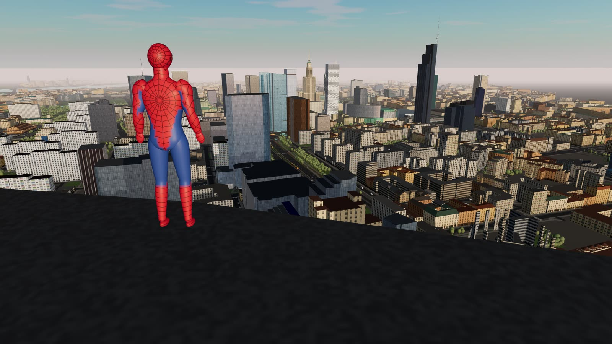
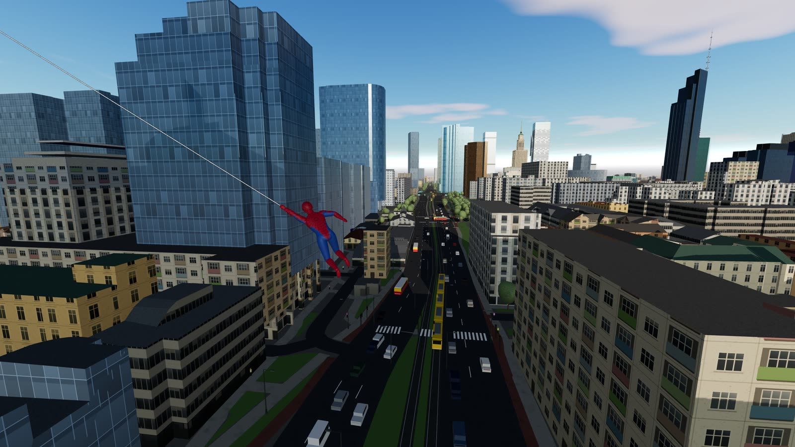
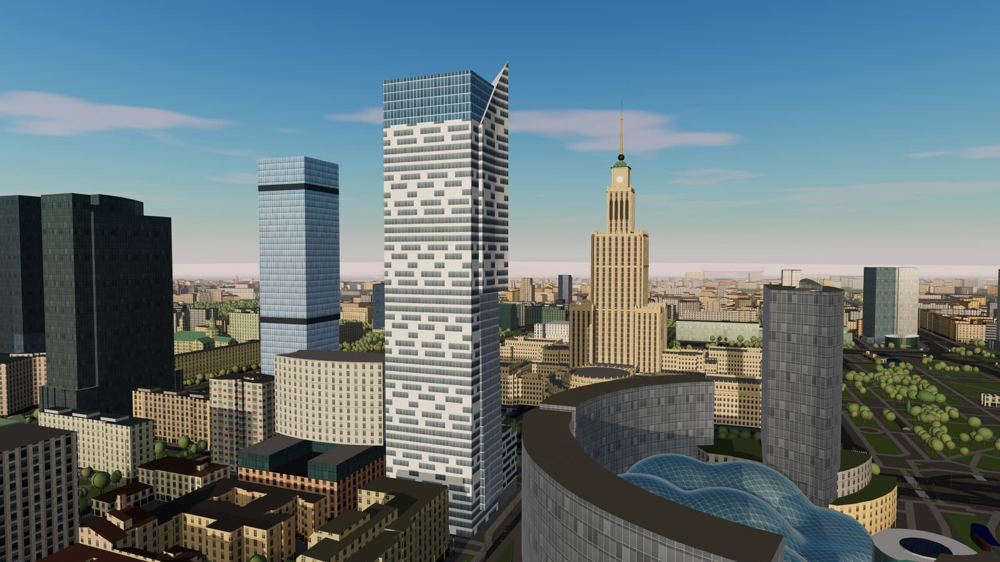
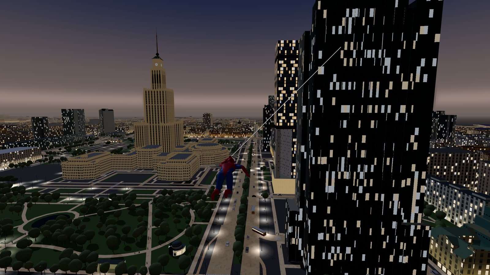
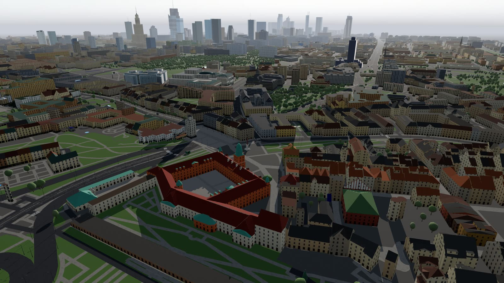
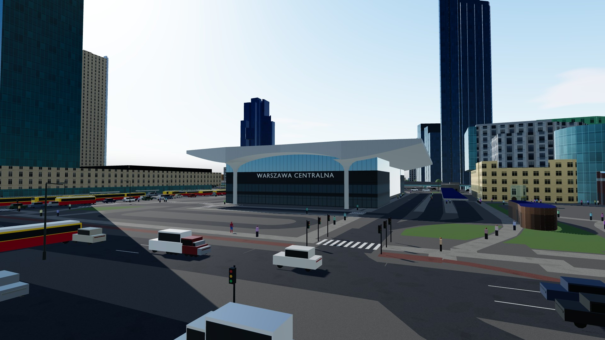
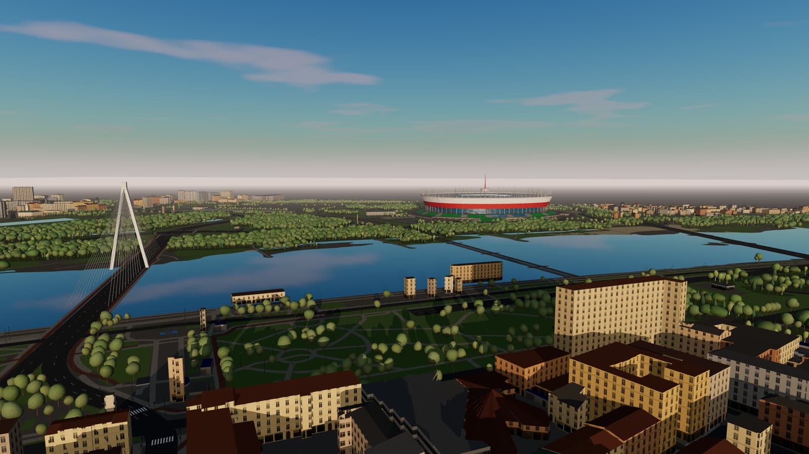

# Warszawa na sieci

Demo technologiczne 3D w przeglądarce: bujasz się na sieci nad **współczesną Warszawą**. Miasto powstało z otwartych danych
(OpenStreetMap, modele 3D budynków GUGiK), a najważniejsze budynki odtworzono jako osobne modele w Blenderze.
Cały projekt (kod, modele, przetwarzanie danych) napisał **Claude Code** pod kierunkiem człowieka. To pokaz
możliwości obecnych modeli AI i tempa ich rozwoju. Jak to przebiegało, ile trwało i ile kosztowało, opisuje
[CASE_STUDY.md](CASE_STUDY.md).

[](https://lukasbialozor.github.io/warszawa-na-sieci-demo/)

| | |
|---|---|
|  |  |
|  |  |
|  |  |

## Wypróbuj

Wersja online: **[lukasbialozor.github.io/warszawa-na-sieci-demo](https://lukasbialozor.github.io/warszawa-na-sieci-demo/)**
(przy pierwszym wejściu ok. 7 MB do pobrania dzięki kompresji, 19 MB po rozpakowaniu; kopia zapasowa: [artefakt claude.ai](https://claude.ai/artifact/7cQnEK5YTdtchLC79KEtgL)).
Demo działa w przeglądarce z WebGL2 (aktualny Chrome, Edge, Firefox lub Safari): na komputerze z klawiaturą i myszą oraz na telefonie lub tablecie ze sterowaniem dotykowym.

| Klawisz | Działanie |
|---|---|
| `W` `A` `S` `D` | ruch |
| `Shift` | sprint, bieg po ścianie |
| `Spacja` | skok, w trakcie bujania wybicie |
| `LPM` / `F` (trzymaj) | bujanie na sieci |
| `PPM` / `E` | przyciągnięcie do punktu pod celownikiem |
| `C` | nurkowanie |
| `1`–`8` | teleport: PKiN, Rondo ONZ, Varso, Rondo Daszyńskiego, Warsaw Spire, Plac Zamkowy, Most Świętokrzyski, Stadion Narodowy |
| `T` | czas +3 godziny (doba trwa 24 minuty) |
| `Q` | jakość wysoka/niska (przy niskim FPS obniża się sama) |
| `R` / `H` | powrót na ostatni punkt / pomoc |

Na ekranie dotykowym:

| Gest / przycisk | Działanie |
|---|---|
| lewy kciuk (drążek) | ruch; wychylenie do końca = sprint i bieg po ścianie |
| przeciąganie po prawej stronie | rozglądanie (w biegu kamera sama obraca się za bohaterem) |
| `SIEĆ` (trzymaj) | bujanie; przeciągając palcem po przycisku, celujesz |
| `DO KROPKI` | przyciągnięcie do punktu pod kropką na środku ekranu (jak `PPM`) |
| `SKOK` | skok, wybicie z liny, odbicie od ściany (jak `Spacja`) |
| `?`, `Miejsca`, `+3 h`, `Pauza` | podpowiedź, teleport, czas, pauza |

Na ścianie drążek działa względem muru: do przodu = wspinaczka, niezależnie od ustawienia kamery. Telefon najlepiej
trzymać poziomo. Na urządzeniach dotykowych demo startuje w niskiej jakości, z krótszym zasięgiem rysowania
i połową ruchu ulicznego.

## Co jest w środku

- **Miasto ok. 5 × 3,5 km** (Wola, Śródmieście, Stare Miasto, Powiśle, Praga), czyli ok. 11 tys. budynków z OSM,
  z których ok. 4 tys. ma rzeczywiste kształty dachów z modeli **LOD2 GUGiK**. Model LOD2 zastępuje budynek z OSM
  tylko wtedy, gdy wysokości się zgadzają, bo dane LOD2 pochodzą ze skanowania z 2012 roku. Nowe budynki
  (Varso, The Warsaw Hub, Skyliner) zostają z OSM.
- **Landmarki modelowane w Blenderze** skryptami Pythona:
  - Pałac Kultury i Nauki: lizeny, attyki ze sterczynami, zegary, iglica;
  - Dworzec Centralny: dach o przekroju „trzech krzywych” i 28 słupów z kielichowymi głowicami;
  - falujący szklany dach Złotych Tarasów;
  - Złota 44: bryły z części budynku w OSM (rdzeń, „żagiel” ze skośnym wierzchem do 192 m, przeszklone fałdy,
    podium), biała elewacja w poziome pasy z oknami różnej długości, nocą zapalone okna mieszkań;
  - InterContinental: prześwit między 5. a 21. piętrem (ok. 17–72 m) z kamienną skośną ścianą i kasetonowym
    stropem, nocą okna pokoi;
  - Most Świętokrzyski: pylon w kształcie litery A (90 m) i 48 want w dwóch płaszczyznach;
  - kratownicowa iglica Varso, maszt Centrum LIM, Kolumna Zygmunta.
- **Ulice:**
  - oznakowanie pasów według danych OSM (klasa drogi, liczba pasów, jednokierunkowość);
  - ok. 1900 przejść dla pieszych, szyny tramwajowe;
  - ok. 11 tys. latarni i 3 tys. sygnalizatorów;
  - 44 tys. drzew w kształtach zależnych od gatunku z OSM.
- **Życie miasta:** samochody i autobusy (w barwach warszawskiej komunikacji) jeżdżą prawą stroną według grafu
  ulic, trójczłonowe tramwaje jeżdżą po torach, piesi chodzą chodnikami.
- **Pora dnia:** prawdziwa droga słońca nad Warszawą dla bieżącej daty, noc z gwiazdami, oświetlone okna,
  latarnie, reflektory pojazdów i podświetlony PKiN.
- **Fasady:** 8 proceduralnych stylów (kamienica, blok z wielkiej płyty, biurowiec, socrealizm, Stare Miasto,
  hala, nowy budynek, starszy budynek) z osobnym parterem. Styl zależy od dzielnicy, typu, wysokości i daty
  budowy zapisanej w OSM.
- **Orientacja:** HUD pokazuje ulicę, obszar i dzielnicę. Tablice pojawiają się przy wejściu do nowej dzielnicy
  i przy landmarkach, a wieżowiec, na którym stoisz, jest podpisany.
- **Fizyka:** wahadło z liną (punkt obrotu przesunięty nad tor lotu), przyciąganie do punktu, nurkowanie, bieg
  i wspinaczka po ścianach (kierunek względem muru, nie kamery), przeskok przez krawędź dachu (także spadzistego)
  i kolizje z każdym budynkiem.
- **Kamera:** promienie kolizji zawsze z głowy bohatera; przy ścianie kamera zjeżdża wzdłuż muru albo odsuwa się w bok,
  a celownik dalej wskazuje kierunek ustawiony myszą lub palcem. Do 75° w górę (celowanie w krawędź dachu z podwórka).
- **Wydajność:** drzewa, latarnie i sygnalizatory (ok. 100 tys. obiektów) są odrzucane po komórkach siatki 100 m kilka
  razy na sekundę zamiast w każdej klatce - czas procesora na klatkę spadł z ok. 12 ms do ok. 2 ms.

## Technologie

[three.js](https://threejs.org) (WebGL2), [Vite](https://vite.dev),
[three-mesh-bvh](https://github.com/gkjohnson/three-mesh-bvh) (raycasty sieci i kamery), Blender 5.2 sterowany
skryptami `bpy` (tryb wsadowy, bez okna), [proj4](https://github.com/proj4js/proj4js) (EPSG:2180 → WGS84),
Overpass API (OpenStreetMap).

## Uruchomienie lokalne

Potrzebny jest Node.js 20.19+ lub 22.12+ (wymaganie Vite 8; `.nvmrc` i `netlify.toml` używają Node 22).

```bash
npm install
npm run dev
```

Demo działa pod `http://localhost:5173`. Gotowe dane miasta (`public/data`) i modele (`public/models`) są
w repozytorium, więc nic więcej nie trzeba pobierać.

### Odtworzenie danych od zera (opcjonalnie)

```bash
npm run fetch-osm          # OSM przez Overpass API -> data/raw/osm.json (~40 MB, cache kafli w data/raw/cache/)
npm run build-city         # OSM -> public/data/city.json, potem LOD2 -> public/data/lod2.*
npm run build-landmarks    # modele z Blendera -> public/models/*.glb (zmienna BLENDER = ścieżka do Blendera)
```

`build-city` korzysta z paczki LOD2 dla Warszawy:
[1465_gml.zip](https://opendata.geoportal.gov.pl/InneDane/Budynki3D/LOD2/1465_gml.zip) (116 MB, CityGML).
Pobraną paczkę zapisz jako `data/raw/gugik/1465_gml.zip`. Bez niej `build-city` pomija krok LOD2, ale w `public/data`
zostają `lod2.json` i `lod2.bin` z repozytorium. Ich lista zastąpionych budynków (`replaced`) pasuje tylko do
starego `city.json`, więc usuń oba pliki, a demo użyje samych brył z OSM. Krok LOD2 wywołuje `unzip` i `sh`, więc
muszą być w `PATH` (na Windows np. z Git Bash). `build-landmarks` wymaga Blendera 5.2.

## Publikacja (darmowy hosting statyczny)

Zbudowana wersja to same pliki statyczne (ok. 19 MB, z czego kod to ok. 0,26 MB po kompresji gzip). `vite.config.js` ma
ustawione `base: './'`, więc strona działa z dowolnego katalogu.

- **GitHub Pages** (tak działa wersja online): `npm run deploy:pages` buduje stronę i wypycha `dist/` jako gałąź
  `gh-pages` (remote `public`; w *Settings → Pages* źródło *Deploy from a branch → gh-pages*). Zamiast tego można
  użyć workflow [`docs/deploy-pages.yml`](docs/deploy-pages.yml) skopiowanego do `.github/workflows/` (*Source: GitHub
  Actions*). Link do repozytorium na ekranie startowym ustawi się sam. Miękki limit Pages to 100 GB miesięcznie,
  czyli ok. 15 tys. pierwszych wejść (ok. 7 MB na wejście po kompresji gzip).
- **Cloudflare Pages:** komenda budowania `npm run build`, katalog wyjściowy `dist`. Ruch do plików statycznych jest
  tu darmowy i bez limitu, więc to najbezpieczniejszy wybór przy dużej liczbie odwiedzin.
- **Netlify:** *Add new site → Import from Git*. Ustawienia są w `netlify.toml`. Uwaga: darmowy plan (300 kredytów
  miesięcznie, 20 kredytów za 1 GB) wystarcza na ok. 2 tys. wejść po ok. 7 MB, a po wyczerpaniu limitu Netlify
  wstrzymuje wszystkie strony konta do końca miesiąca.
- **Inny serwer:** `npm run build` i skopiuj zawartość `dist/`.
- **Artefakt claude.ai** (kopia zapasowa wersji online): `npm run build:artifact` tworzy `dist-artifact/` dla
  hostingu, który nie serwuje plików binarnych. Model LOD2 i modele `.glb` trafiają tam jako base64 w plikach `.txt`,
  a strona `artifact.html` nie ma własnego `<head>` (szkielet dodaje hosting). Strona działa pod restrykcyjnym CSP
  (`connect-src 'self'`), dlatego tekstury modeli są dekodowane bez `fetch()` (`src/binary.js`).

Poza GitHub Pages adres repozytorium podaj przy budowaniu (`VITE_REPO_URL=https://github.com/...`) albo wpisz go
w `src/config.js`.

## Struktura

| Ścieżka | Zawartość |
|---|---|
| `src/main.js` | pętla główna, teleporty, jakość, start (pointer lock lub dotyk) |
| `src/geo.js` | wycinek miasta, rzutowanie lat/lon → metry, miejsca teleportu i landmarki (wspólne dla aplikacji i narzędzi) |
| `src/hud.js`, `src/discovery.js` | HUD (prędkość, wysokość, stan, FPS, komunikaty, pomoc), tablice nowej dzielnicy i landmarku, podpis wieżowca |
| `src/touch.js`, `src/input.js` | sterowanie dotykowe, klawiatura i mysz |
| `src/camera.js` | kamera trzecioosobowa z kolizją (poślizg wzdłuż przeszkód, odsuwanie w bok) |
| `src/binary.js`, `src/config.js` | wczytywanie plików binarnych i modeli, ustawienia (repozytorium, zasięgi na telefonach) |
| `src/world/` | miasto (`city.js`), kolizje, dachy, tekstury i style fasad, drzewa, oznakowanie, latarnie, ruch uliczny, niebo i pora dnia, landmarki, ulica/obszar/dzielnica pod bohaterem (`location.js`), odrzucanie obiektów (`cull.js`) |
| `src/player/` | fizyka bohatera, sieć, animacja postaci |
| `tools/` | pobieranie OSM, budowa miasta, dopasowanie LOD2, budowanie modeli, wersja dla artefaktu claude.ai (`build-artifact.mjs`), publikacja na GitHub Pages (`deploy-pages.mjs`), ręczne poprawki tagów OSM (`overrides.mjs`), skrypty diagnostyczne (`debug/`) |
| `blender/` | skrypty modeli (bohater, PKiN, dworzec, Złote Tarasy, Złota 44, InterContinental, Most Świętokrzyski, iglice: iglica Varso, maszt LIM i Kolumna Zygmunta) i wspólne funkcje `lm_common.py` |
| `CLAUDE.md` | notatki projektu dla Claude Code: konwencje, pułapki, sposób testowania |

## Licencje i źródła

- **Kod i modele z Blendera:** MIT (patrz [LICENSE](LICENSE)); zakres licencji i licencje danych opisuje
  [NOTICE.md](NOTICE.md). Licencje bibliotek (three.js, three-mesh-bvh) trafiają przy budowaniu do
  `THIRD_PARTY_LICENSES.md` w `dist/`.
- **Dane mapy:** © współtwórcy [OpenStreetMap](https://www.openstreetmap.org/copyright), licencja ODbL.
- **Modele budynków LOD2:** [GUGiK](https://www.geoportal.gov.pl) (Budynki 3D, udostępniane bezpłatnie).
- **Zdjęcia** (od autora projektu i z Wikimedia Commons) służyły wyłącznie jako materiał referencyjny przy
  modelowaniu. Żadne zdjęcie nie trafiło do projektu: wszystkie tekstury są generowane proceduralnie.
- To projekt fanowski, niekomercyjny, niezwiązany z Marvel ani Sony.

---

### English summary

A browser-based web-swinging tech demo set in present-day Warsaw, Poland, showing what current AI models can build
and how fast they are improving. The city is built from OpenStreetMap and the Polish GUGiK LOD2 3D-building dataset. Landmarks (Palace of Culture and Science, Warszawa Centralna station,
Złote Tarasy, Złota 44, the InterContinental hotel, the Świętokrzyski Bridge pylon, the Varso Tower spire, the
Centrum LIM mast and Sigismund's Column) are modeled procedurally with Blender Python scripts. The demo also has
traffic, trams, pedestrians and a real-sun day/night cycle, and runs on desktop (keyboard and mouse) and on
phones and tablets (touch controls). The whole project was written by Claude Code
(Anthropic) with a human directing it. See [CASE_STUDY.md](CASE_STUDY.md) (in Polish) for the process, tools,
time and token cost. Live demo: https://lukasbialozor.github.io/warszawa-na-sieci-demo/ · run it locally with
`npm install && npm run dev` (Node.js 20.19+ or 22.12+). Code: MIT; map data:
© OpenStreetMap contributors (ODbL) and GUGiK, see [NOTICE.md](NOTICE.md).
